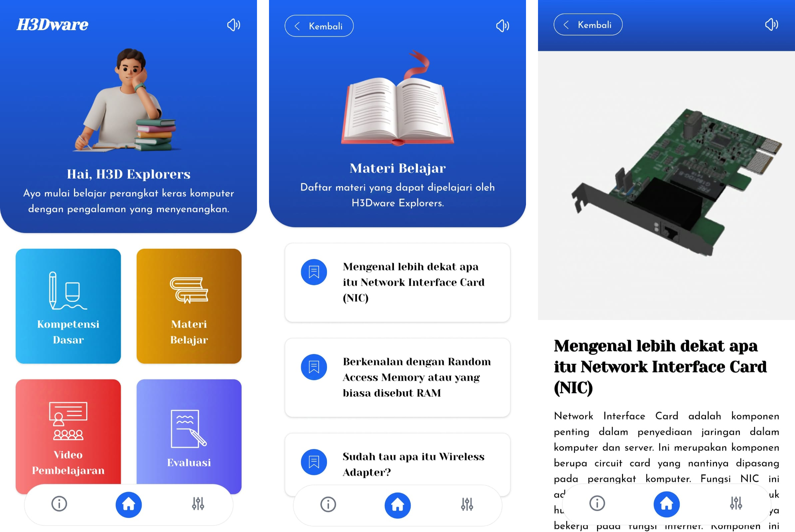

# 3D Hardware Computer
Media Pembelajaran 3D Perangkat Keras Komputer adalah perpaduan antara teknologi perangkat keras dengan inovasi dalam media pembelajaran. Tujuan utamanya adalah menghadirkan pengalaman belajar yang lebih interaktif, immersif, dan mudah diakses untuk memahami komponen komputer. Melalui pendekatan modern 3D, pengguna dapat melihat, memanipulasi, dan memahami perangkat keras secara visual, sehingga konsep-konsep teknis yang kompleks menjadi lebih mudah dipahami dan dipelajari.

## Screenshot App

## Tech Stack

